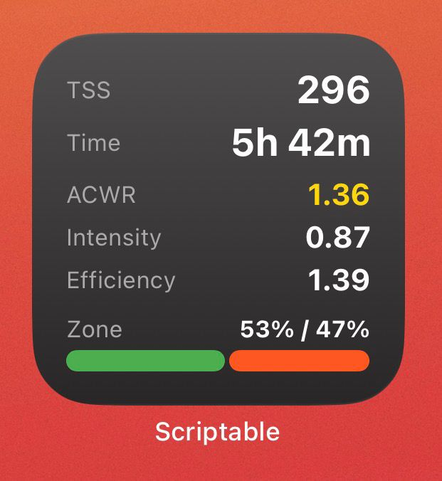

# Strava widget for performance metrics 

Mobile widgets for fast access to performance stats from strava: 
1. Training Stress Score - TSS;
2. Intensity Factor - IF;
3. Acute:Chronic Workload Ratio - ACWR;
4. Efficiency;
5. Zones - low / high percentage.

## Pre-requirements

1. Currently support only IOS;
2. Create strava client id, secret and refresh token;
3. Download [scriptable app](https://apps.apple.com/us/app/scriptable/id1405459188);

## Create Strava perfsonal application
...

## Create widget in scriptable
...

## Copy code and replace values
...

## Running widget
...
